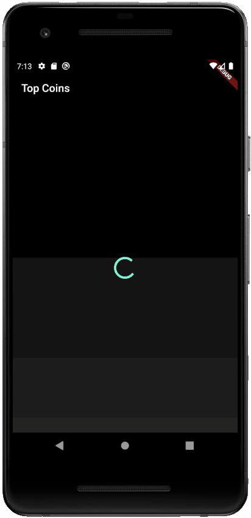

# CryptoCoins App

I created this app by following the course by [Marcus Ng](https://marcus-ng.com/).

[Course Link](https://marcus-ng.com/p/flutter-bloc-crypto-app-with-api)

## Skills Covered

* Using the Bloc Pattern for State Management
* Using the http package for downloading data from the CryptoCompare API
* Adding a RefreshIndicator to a ListView
* Detecting the scroll position of the ListView. Using this, we can download more data when the bottom of the page is reached.

## Screenshot

